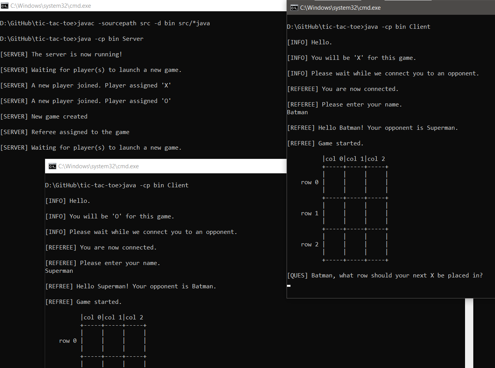

# Tic Tac Toe

A client-server based multi-user Tic Tac Toe game

## Features

+ Supports multiple users

+ Each game has it's own thread using threadpools

+ Communication between the players is managed through sockets

## Dependencies

+ JDK version 11.0.11 or above

## How to run

1. Clone the repository on your machine

2. Open a new terminal and run the server using [`run_server.cmd`](run_server.cmd) or [`run_server.sh`](run_server.sh)

3. To launch individual clients, run the file [`run_client.cmd`](run_client.cmd) or [`run_client.sh`](run_client.sh) atleast two times in different terminals

4. Enjoy the game

## Screenshots

